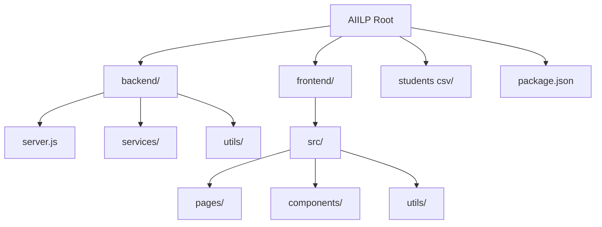

# Project Hierarchy Analysis

The **Academic Industry Internship Linkage Platform (AIILP)** is a full-stack web application designed to connect students with software houses for internship opportunities. It uses a modern JavaScript stack with a decoupled backend and frontend.

## 🛠 Technology Stack

- **Frontend**: Vite + React + Tailwind CSS
- **Backend**: Node.js + Express
- **Database**: Supabase (PostgreSQL + Auth + Storage)
- **Communication**: REST API (Express standard)

---

## 📂 Root Structure



```text
AIILP/
├── backend/            # Express.js Server & Supabase Integration
├── frontend/           # React.js Client Application
├── students csv/       # Data for bulk student imports
├── package.json        # Root workspace configuration
└── node_modules/       # Shared dependencies
```

---

## ⚙️ Backend Architecture (`/backend`)

The backend follows a service-oriented pattern, centralizing business logic in services and routing in `server.js`.

- **`server.js`**: The main entry point. Handles Express configuration, middleware (CORS, Multer, JSON), and defines the REST API endpoints.
- **`services/`**: Contains core business logic.
  - `authService.js`: User authentication and session management.
  - `studentService.js`: Student-specific operations (profiles, academic data).
  - `internshipService.js`: Database logic for internship listings.
  - `applicationService.js`: Managing student applications to internships.
  - `cvService.js`: Resume generation and storage.
- **`config/`**: Setup for external integrations like `supabase.js`.
- **`utils/`**: Shared helpers like `csvParser.js` (for bulk student uploads) and general `helpers.js`.
- **`uploads/`**: Local storage for temporary file processing (e.g., profile pictures).

---

## 🎨 Frontend Architecture (`/frontend/src`)

The frontend is a React application built with Vite, organized for role-based access control.

- **`pages/`**: Main views categorized by user roles:
  - `admin/`: Dashboard and tools for system administrators.
  - `university/`: University-specific management (student bulk uploads, etc.).
  - `student/`: Student dashboard, profiles, and applications.
  - `software_house/`: Internship listing management and applicant tracking.
  - `guest/`: Publicly accessible pages.
- **`components/`**: Reusable UI elements:
  - Shared: `Header.jsx`, `Sidebar.jsx`, `Modal.jsx`, `Table.jsx`.
  - Charting: `charts/` for analytics and progress tracking.
- **`context/`**: State management (likely AuthContext for session handling).
- **`hooks/`**: Custom React hooks for data fetching and recurring logic.
- **`utils/`**: Frontend utility functions (API callers, formatters).

---

## 🔗 Key Integration: Supabase

The project heavily relies on **Supabase** for:
1. **Authentication**: Managing user signups, logins, and role-based metadata.
2. **Database (PostgreSQL)**: Storing profiles, students, internships, and applications.
3. **Storage**: Hosting CVs and profile pictures.
4. **Admin Access**: Using the `Service Role Key` for privileged operations like creating users and bulk imports.
