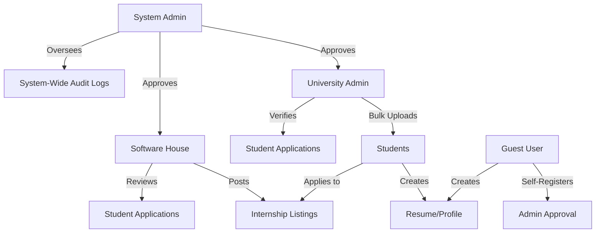

# Role Hierarchy & Permissions

The AIILP platform operates on a multi-tenant, role-based access control (RBAC) system. Each role has distinct responsibilities and interaction flows.

## 🌳 Role Tree



## 🌳 Role Folder Structure (Frontend)

To understand how these roles are implemented, here is the directory structure for each role's dashboard and features:

```text
frontend/src/pages/
├── 👑 admin/               # System Admin Pages
│   ├── Analytics.jsx
│   ├── AuditLogs.jsx
│   ├── Dashboard.jsx
│   ├── Notifications.jsx
│   ├── PendingAccounts.jsx
│   ├── PendingInternships.jsx
│   ├── Settings.jsx
│   └── UserManagement.jsx
├── 🎓 university/          # University Admin Pages
│   ├── Analytics.jsx
│   ├── BulkUpload.jsx
│   ├── Dashboard.jsx
│   ├── Notifications.jsx
│   ├── Settings.jsx
│   ├── StudentApplications.jsx
│   ├── StudentDetail.jsx
│   └── Students.jsx
├── 🏢 software_house/      # Software House Pages
│   ├── Analytics.jsx
│   ├── Dashboard.jsx
│   ├── ManageApplications.jsx
│   ├── MyInternships.jsx
│   ├── Notifications.jsx
│   ├── PostInternship.jsx
│   └── Settings.jsx
├── 🧑‍🎓 student/             # Student Pages
│   ├── Analytics.jsx
│   ├── Dashboard.jsx
│   ├── Notifications.jsx
│   └── Settings.jsx
└── 👤 guest/               # Guest User Pages
    └── Dashboard.jsx
```

---

## 👥 Detailed Role Responsibilities

### 1. 👑 System Admin (SuperUser)
The core authority of the platform.
- **Access Level**: Full system control.
- **Key Responsibilities**:
    - **Account Approval**: Reviews and approves registration requests from Universities and Software Houses.
    - **User Management**: Can activate or deactivate any user account.
    - **Internship Oversight**: Reviews internship postings for quality and compliance.
    - **System Health**: Monitors audit logs and system-wide analytics.

### 2. 🎓 University Admin
Representative of an academic institution.
- **Access Level**: Institution-specific control.
- **Key Responsibilities**:
    - **Bulk Enrollment**: Uploads student records via CSV to pre-verify them for the platform.
    - **Student Monitoring**: Tracks the progress and placement of their students.
    - **Detail Review**: Views detailed profiles of their own students.

### 3. 🏢 Software House (Employer)
Industry partners seeking talent.
- **Access Level**: Recruitment & Listing control.
- **Key Responsibilities**:
    - **Recruitment**: Posts internship opportunities with specific skills and requirements.
    - **Applicant Tracking**: Reviews student CVs, filters applications, and moves candidates through the hiring pipeline.
    - **Analytics**: Tracks hiring metrics and internship popularity.

### 4. 🧑‍🎓 Student (Applicant)
The primary user, pre-verified and uploaded by a University.
- **Access Level**: Personal Profile & Application control.
- **Key Responsibilities**:
    - **Profile Building**: Creates a digital CV and profile.
    - **Job Search**: Browses internships.
    - **Application Submission**: Applies for internships and tracks status.

### 5. 👤 Guest User
Independent learners or students not linked to an official university partner on the platform.
- **Access Level**: Limited access until Admin Approval, then similar to Student.
- **Key Responsibilities**:
    - **Self-Registration**: Requests access manually rather than being bulk-uploaded.
    - **Approval Process**: Must be manually vetted by a System Admin.
    - **Career Search**: Once approved, can use the CV builder and internship marketplace similar to a Student.

---

## 🔄 Interaction Flow

1.  **Onboarding**: **University** or **Software House** signs up → **Admin** approves them.
2.  **Student Setup**: **University** uploads **Students** → **Students** log in and complete profiles.
3.  **Marketplace**: **Software House** posts an **Internship** → **Admin** approves it → it goes live.
4.  **Application**: **Student** applies to an **Internship** → **Software House** reviews and accepts/rejects.
